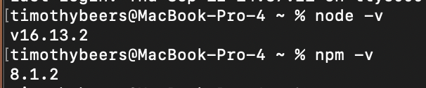
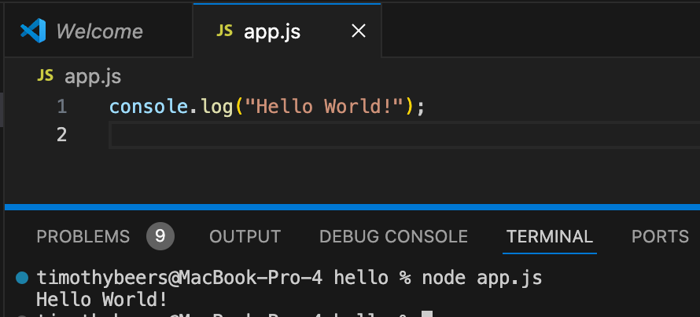
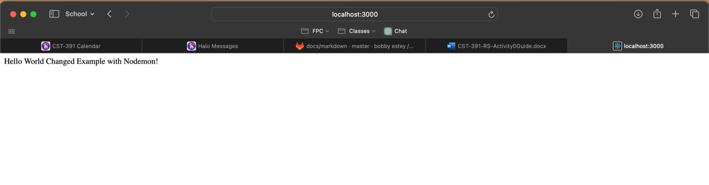
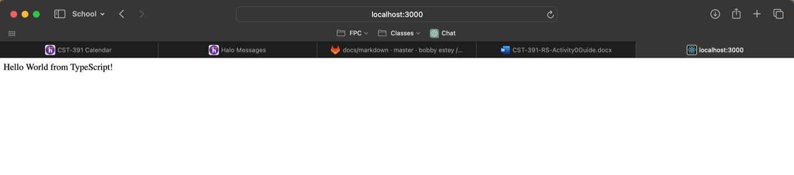
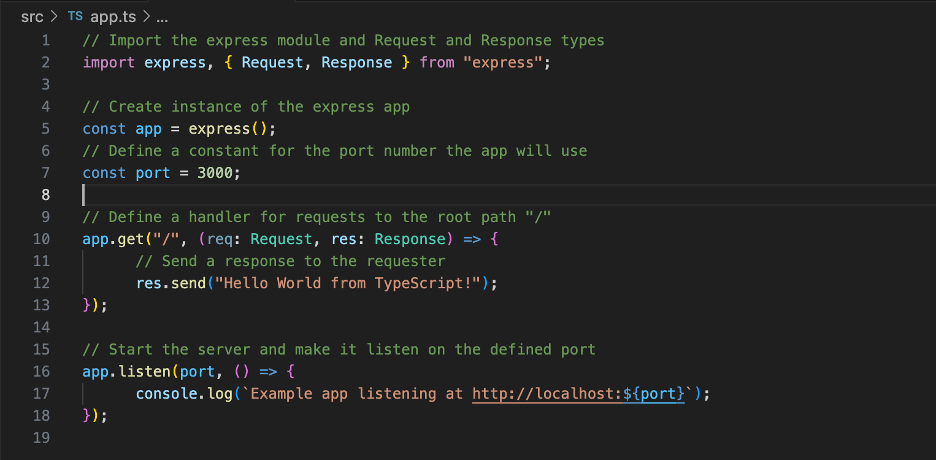

# Activity 0

Timothy Beers \
College of Science, Engineering, & Technology, Grand Canyon University \
CST-391: JavaScript Web Application Development \
Professor Bobby Estey
 
## Introduction

- Activity 0 is about setting up our environment and getting a basic javascript and typescript app running locally in the browser.

## Part 1

- This is a screenshot of my npm and node versions. My download for the updated versions is moving very slowly, so I am proceeding with this Activity using the versions that were already on my computer.

- This screenshot demonstrates the execution of the bare minimum Hello World app in js.

- This screenshot shows the Hello World app running in the browser.

- This screenshot shows the Hello World app running with Nodemon, with the string changed after the app was already running (hot reloaded).

## Part 2

- These screenshots show the conversion to typescript, with the app running in the browser and the associated code.

# Conclusion

This Activity demonstrated the basic setup and use of javascript and typescript, along with some tools that aid in running and debugging both effectively.