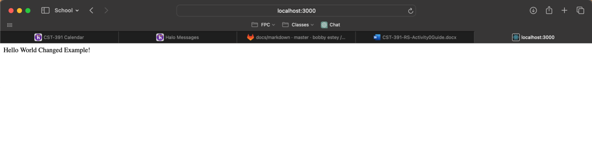

# Activity 0

- Timothy Beers
- College of Science, Engineering, & Technology, Grand Canyon University
- CST-391: JavaScript Web Application Development
- Professor Bobby Estey
- 20 September 2024
 
## Introduction

- Activity 0 was about...

## Part 1

- This is a screenshot of my npm and node versions. My download for the updated versions is moving very slowly, so I am proceeding with this Activity using the versions that were already on my computer.

## Part 2

 
## Screen recording

# Conclusion

My conclusion...