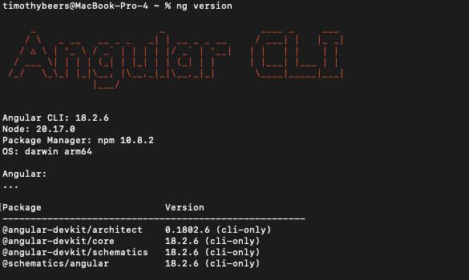
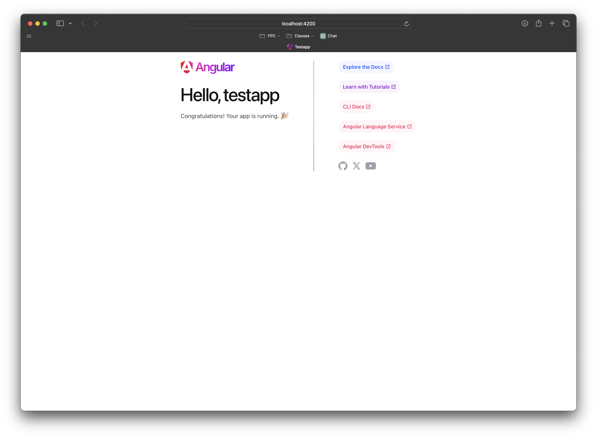
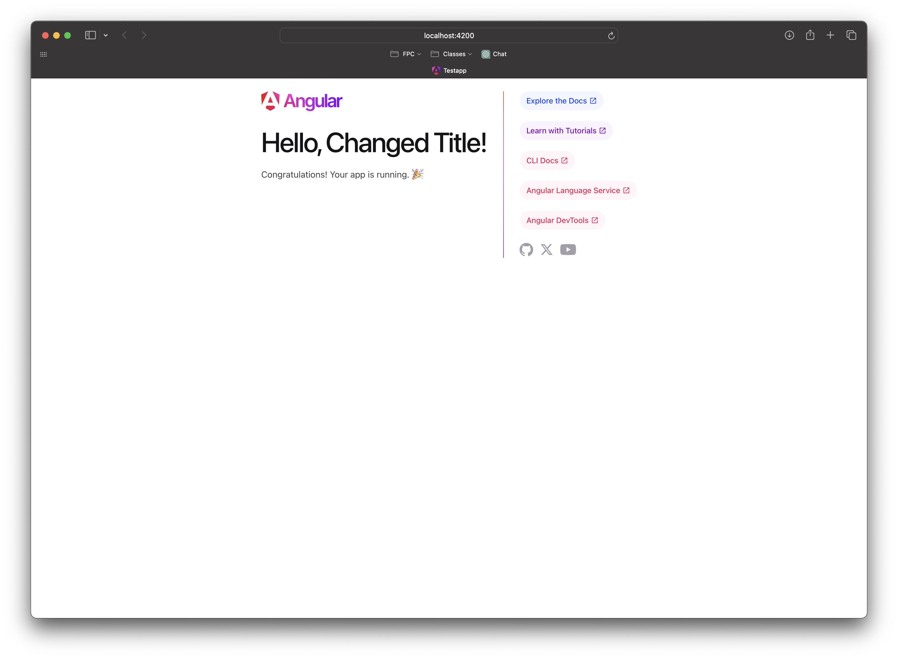
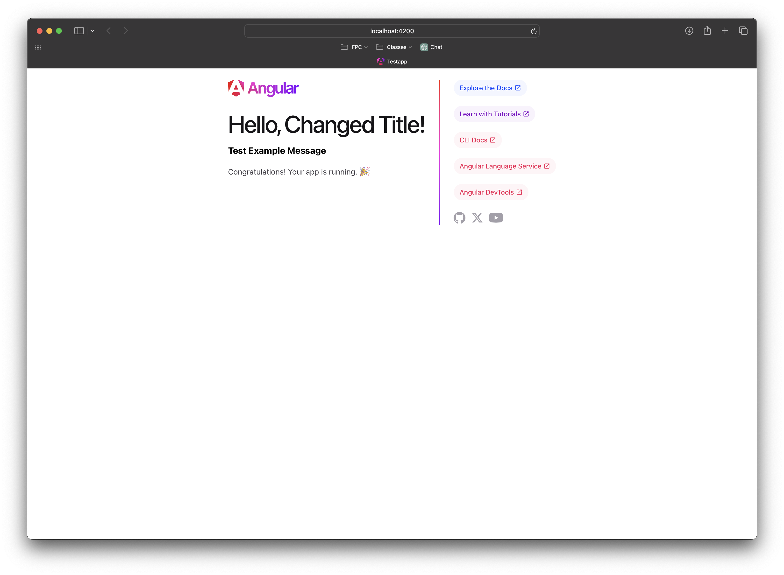

# Activity 2

<!-- 1. Cover Sheet -->
Timothy Beers \
College of Science, Engineering, & Technology, Grand Canyon University \
CST-391: JavaScript Web Application Development \
Professor Bobby Estey

## Introduction

- In this activity, we are installing the Angular development tools. Afterwards, we will validate the tools with a simple test application.

## Screenshots

This screenshot shows the result of the `ng version` command, showing my current angular and node versions.

In this screenshot, we see the default angular application running locally in my browser. It was created using the `ng new` command and then built/run using `ng serve -o`.

Here I changed the title in `app.component.ts` and saw the application reload with the updated String ("Changed Title").

This screenshot shows the addition of a message property to our Component class, which was rendered in an `<h3>` tag in the component template.

## Research

1. Project Structure:
   1. **`node_modules`** contains all npm packages that the Angular project depends on. It is created automatically and new packages will be added here.
   2. **`src`** is the main folder containing the source code for the application
   3. **`src/app`** is the main entry point for the Angular application's codebase. It contains the main modules, components, and services.
   4. **`src/assets`** is used to store static assets like images, fonts, etc. 
   5. **`src/environments`** contains configuration files for different build environments, like development vs. production.
   6. **`angular.json`** is the workspace configuration file. It defines how the app is built and configured.
   7. **`package.json`** defines the project's npm dependencies and scripts.
   8. **`tsconfig.json`** is the TypeScript configuration file, defining how TypeScript compiles the project.

2. The `main.ts` file serves as the entry point of the application, initiating the rendering process. The `app.module.ts` file defines the root module, which imports necessary Angular modules and declares components, including the main component. The `app.component.ts` file acts as the controller for the default view and contains the logic and data binding properties for the component, specifying how data flows within it. The `app.component.html` file is the template for the component, defining the structure and layout of the rendered page using Angular’s templating syntax. The `app.component.css` file provides styling for this component, ensuring that the displayed elements have the intended look and feel. Together, these files define, configure, and style the elements seen on the page, with Angular dynamically combining them to generate the final rendered HTML.

## Conclusion

In this Activity we set up the necessary tools for Angular development, validated their behavior with a test app running locally, and learned about the default project structure provided by Angular apps.