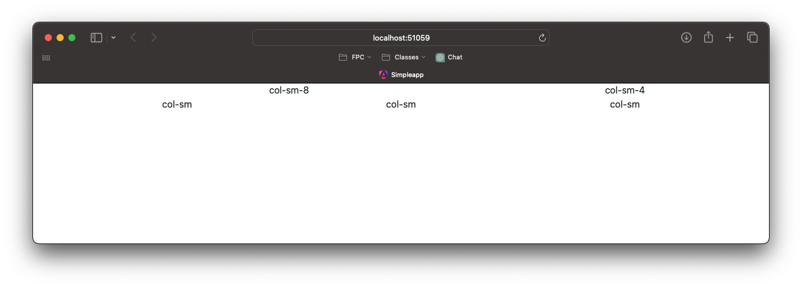
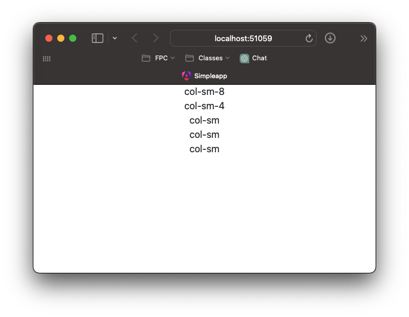
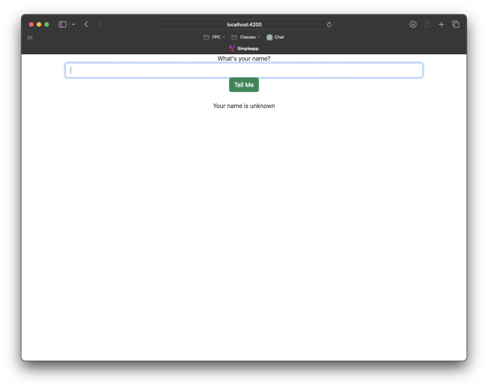
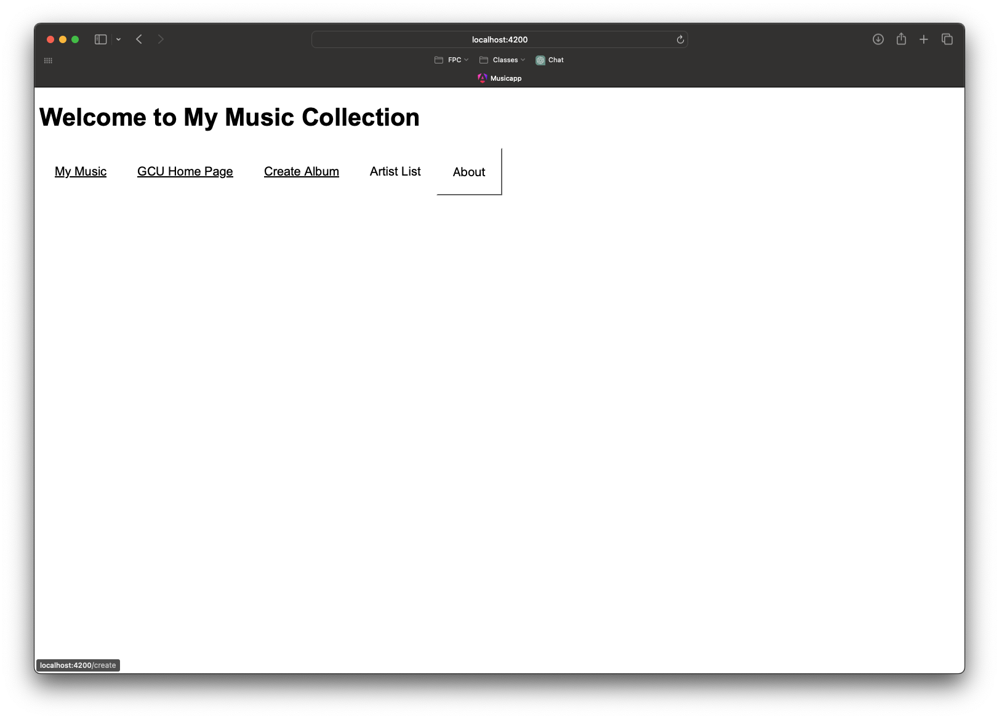
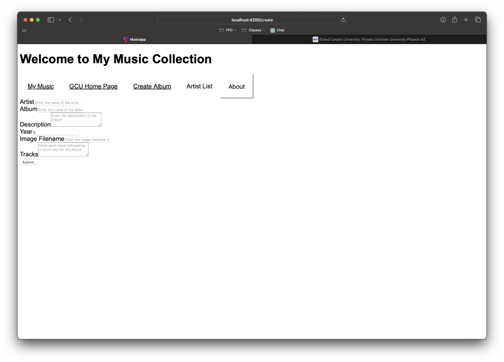
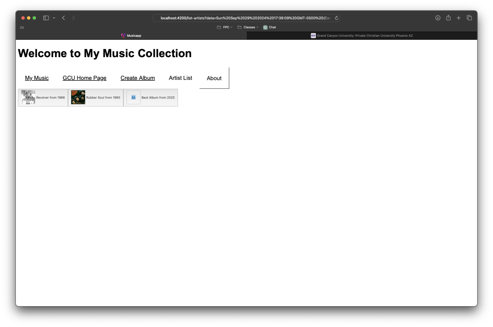
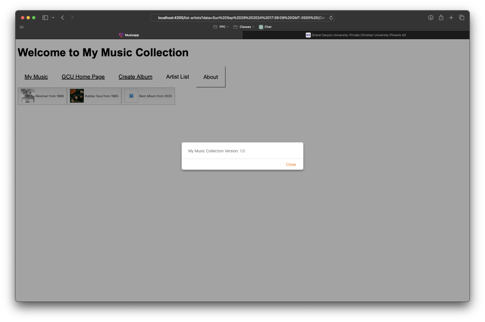

# Activity 3

<!-- 1. Cover Sheet -->
Timothy Beers \
College of Science, Engineering, & Technology, Grand Canyon University \
CST-391: JavaScript Web Application Development \
Professor Bobby Estey

## Introduction

This Activity will go over the setup of 2 simple Angular applications. The first will introduce basic setup and communication between components and views. The second is the start of our frontend application that will eventually connect to the Music API.bn h 

## Part 1 

### Screenshots




These screenshots show a simple bootstrap grid added to our simpleapp, demonstrating a responsive design in varying window sizes.



This screenshot shows the form we created in the shop component, called on by the main app component. The info component is also there, but I couldn't get the `ngIf` logic to work correctly in displaying it on submission (after copying the activity code exactly).

### Research

1. The `@Input` decorator in `info.component.ts` is used to define input properties that allow data to be passed from a parent component to the info component. This enables parent-child communication, making it possible for the parent component to bind values to the child component's properties, which can then be used to dynamically update the child’s view or behavior based on the parent's data.
2. The `[value]` binding in `info.component.html` is a one-way data binding syntax used to bind a property of the component class to the attribute of an HTML element. For example, when `[value]` is used in an `<input>` element, it assigns the specified property’s value to the input field. Any changes in the component property will be reflected in the input element, but changes in the input element won't affect the component property.
3. The `[(ngModel)]` directive in `info.component.html` is used for two-way data binding between a component's property and a form element. It allows synchronization of the form element’s value with the component property, so any changes in the input element update the component’s property, and vice-versa. This is useful for handling user inputs in real-time and reflecting these changes within the component logic or other UI elements.

## Part 2

### Screenshots



This screenshot shows the home page of our music app, with a nav bar that routes to the other available pages.


This screenshot shows the external link from our music app to GCU's website.



Here is the album creation form for the music app.



This is the list of artists, including a custom entry added on the previous album creation page.



This screenshot shows the about box that is presented when about is tapped in the nav bar.

### Research

#### Documented `music-service.service.ts`

```typescript
import { Injectable } from '@angular/core';

import exampledata from '../../data/sample-music-data.json';

import { Album } from '../models/Album';
import { Artist } from '../models/Artist';
import { Track } from '../models/Track';

@Injectable({ providedIn: 'root' })
export class MusicServiceService {
	// Stores the list of artists
	private readonly artists: Artist[] = [];

	// Stores the list of albums
	private readonly albums: Album[] = [];

	constructor() {
   		// Initialize the artist and albums data upon service instantiation
    		this.createArtists();
    		this.createAlbums();
  	}

	// Creates and adds sample artists to the list
	private createArtists(): void {
		this.artists.push(new Artist(0, 'The Beatles'));
	}

	// Creates and adds albums to the list based on sample data
	private createAlbums(): void {
		exampledata.forEach((data: any) => {
			if (data.artist === 'The Beatles') {
				const tracks = data.tracks.map((trackData: any) => new Track(trackData.id, trackData.number, trackData.title, trackData.lyrics, trackData.video));
				const album = new Album(data.id, data.title, data.artist, data.description, data.year, data.image, tracks);
				this.albums.push(album);
			}
		});
	}

	// Retrieves list of artists
	public getArtists(): Artist[] {
		return this.artists;
	}

	// Retrieves list of albums
	public getAlbums(artist: string): Album[] {
		return this.albums;
	}

	// Retrieves a specific album by artist name and album ID
	public getAlbum(artist: string, id: number): Album | undefined {
		const album = this.albums.find((a) => a.Artist === artist && a.Id === id);

		if (album) {
			const tracks = album.Tracks.map((track) => new Track(track.Id, track.Number, track.Title, track.Lyrics, track.Video));
			return new Album(album.Id, album.Title, album.Artist, album.Description, album.Year, album.Image, tracks);
		}

		return undefined;
	}

	// Adds a new album to the list
	public createAlbum(album: Album): void {
		this.albums.push(album);
	}

	// Updates an existing album by replacing it
	public updateAlbum(album: Album): void {
		const index = this.albums.findIndex((a) => a.Id === album.Id);

		if (index !== -1) {
			this.albums.splice(index, 1, album);
		}
	}

	// Deletes an album from the list by ID
	public deleteAlbum(id: number, artist: string): void {
		const index = this.albums.findIndex((a) => a.Id === id);

		if (index !== -1) {
			this.albums.splice(index, 1);
		}
	}
}
```

## Conclusion

In this Activity we learned how to setup a frontend application using Angular. We covered the basics of data management and components communicating with their views. This also involved setting up a Router to navigate to all of the views, and calling on those with links within the views. In future activities, these applications can be hooked up to our REST API to be driven by live data coming from our SQL server.