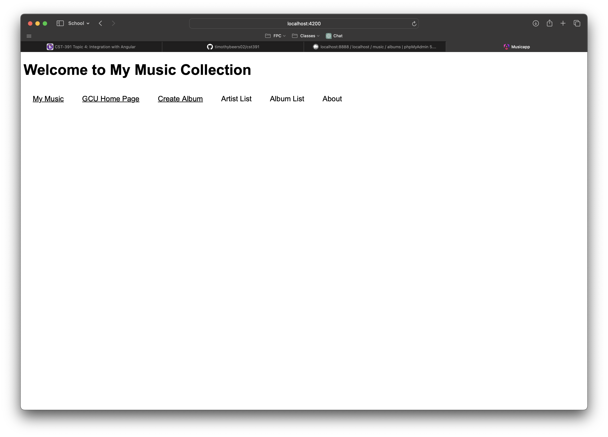
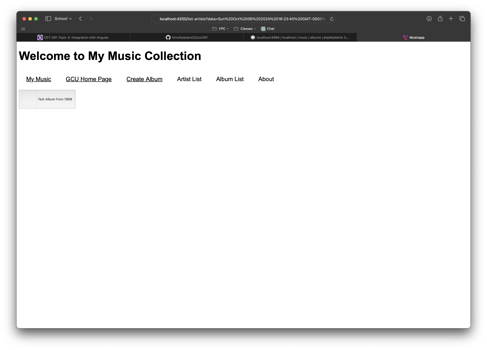
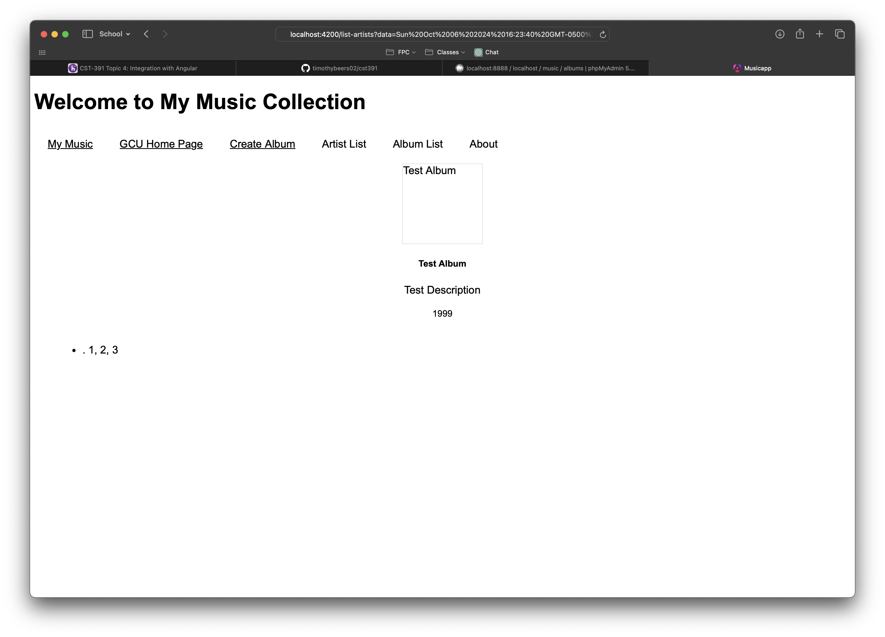
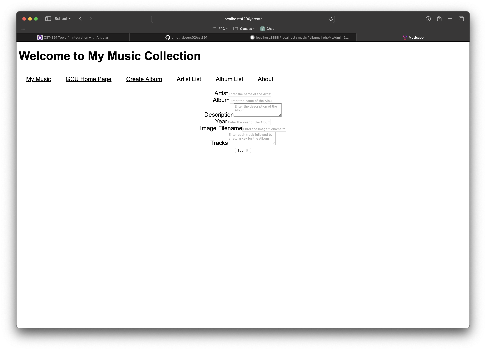

# Activity 4

<!-- 1. Cover Sheet -->
Timothy Beers \
College of Science, Engineering, & Technology, Grand Canyon University \
CST-391: JavaScript Web Application Development \
Professor Bobby Estey

## Introduction

In this Activity we will be removing the mock data and implementing a live connection to our Music API. With this new connection, we will demonstrate the display of albums, artists, and the forms to create them using the API.

## Screenshots

This screenshot shows the landing page of our app. It remains simple with a nav bar showing links to the various pages we've added.

This screenshot shows the list of artists coming back from the API.

This screenshot should show the list of albums coming back from the API. I couldn't quite figure out why my list display wasn't working, so I've displayed a single album here instead.

This is the detail page for an album, with all information including tracks listed. 

This shows the add album page for our application, where we can post new albums through our API, which will then show when looking through our lists.

## Research

1. An Angular application typically maintains a logged-in state using authentication tokens stored either in the browser's local storage or session storage. When a user logs in, the server generates a token and sends it back to the client, where it's stored locally. This token is then included in the headers of HTTP requests for subsequent interactions with the server, indicating that the user is authenticated. Angular's HTTP interceptors are often used to attach the token automatically to outgoing requests. The server, upon receiving the token, validates it to confirm the user's identity and authorization.

## Conclusion

In this Activity we removed mock data from our Angular application and replaced it with a live connection to our API. This included refactoring our music service methods to utilize callbacks, so that consumers could handle the resulting objects/operations. After making this update, we tested the application and demonstrated successful API usage by creating an album with tracks and viewing it on the associated pages.

