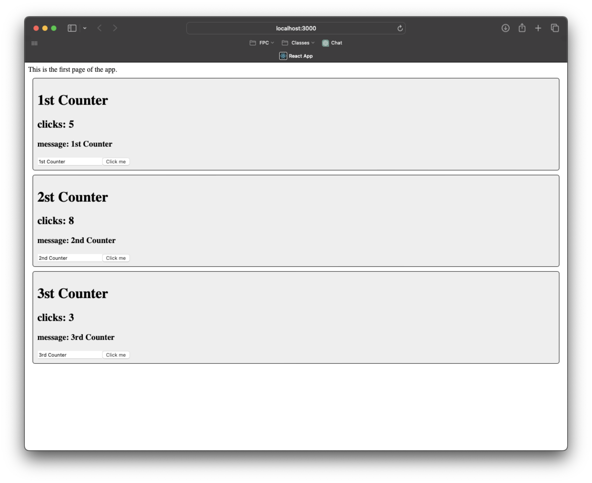

# Activity 5

<!-- 1. Cover Sheet -->
Timothy Beers \
College of Science, Engineering, & Technology, Grand Canyon University \
CST-391: JavaScript Web Application Development \
Professor Bobby Estey

## Introduction

In this activity, we will be setting up two simple React apps. These apps will go over the basics of React components and hooks we can use to update their state.

## Part 1

### Stopping Point #1 Deliverables 

- In this screenshot we have a simple React application showing our Card component that used parameters to display specific album information.

This first application covered the basics of setting up a React application with custom components. We extracted the App into its own component, and also created a Card component that is used by the app. In the Card component we learned how to setup parameters so that callers can pass in different models/values for the view to render. 

### Mini App #1 Deliverables

- In this screenshot we see the use of hooks in our stateful React components. The hooks were used to update the counter titles and count values.

## Part 2

### Stopping Point #2 Deliverables

- This screenshot shows the final state of the Activity 5 music application, with custom CSS to align the cards. Behind the scenes, the data source for the cards has changed as well

### Part 2 Summary

In this second part, we extracted the data source for the cards into a constant local to `App.js`. This constant uses React's `useState` so that we have a method available to update the content when needed. We also learned how to use the `map` method to iterate over our collection of cards and reduce duplicated code when rendering each. 

## Conclusion

In this activity, we learned how to create simple React applications and components. In the components, we learned how to use props and hooks to display static and stateful view data. With hooks, we demonstrated state being updated in real time in our counter app. In our music app, we learned about setting up reusable components, and iterating over them to display several by using the `map` function.