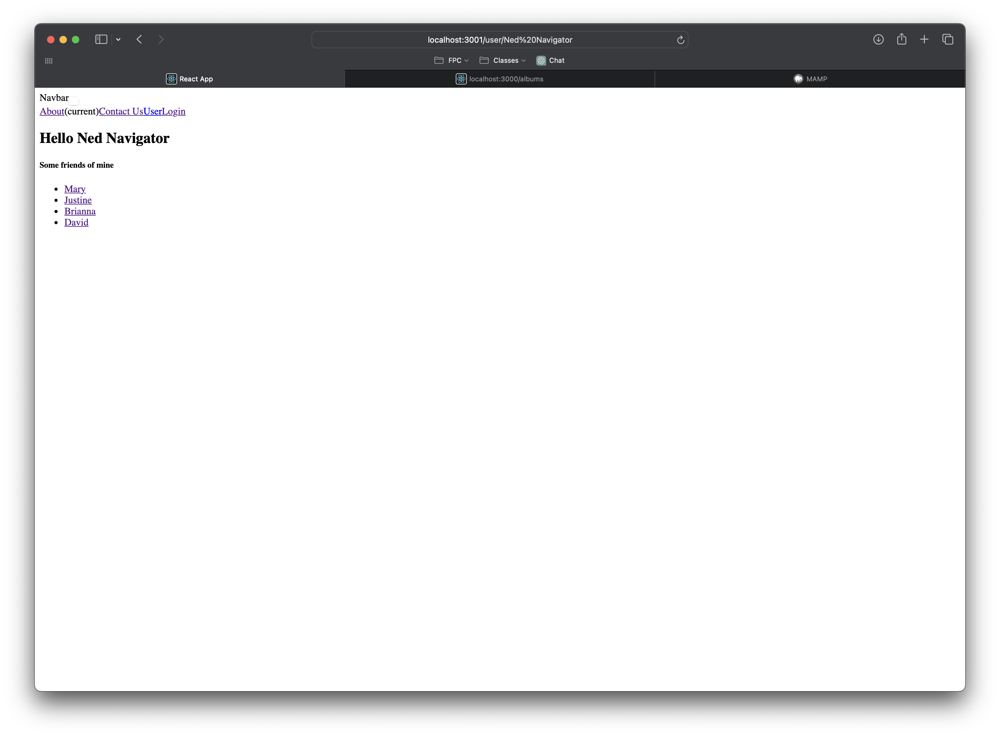

# Activity 6

<!-- 1. Cover Sheet -->
Timothy Beers \
College of Science, Engineering, & Technology, Grand Canyon University \
CST-391: JavaScript Web Application Development \
Professor Bobby Estey

## Introduction

In this activity we will be connecting our React application to live data. In the past, it was hardcoded, but will now come from the REST API. We will also be implementing routing for the React app.

## Part 3

### Screenshots

- This screenshot shows the React application displaying all albums fetched from our Music API.

- This screenshot showcases the search component filtering through the list of albums received.

### Summary

In this part, we started by connecting our React views to some mock json, removing the default values from our `App.js` file. We then added a search component that filters the list based on any descriptions matching the search term. This used callbacks from the search component to the app component that is responsible for the array of albums. Once that was complete, we removed the mock json and called on our Music API instead, retrieving the list of albums from our SQL database.

## Mini App

### Screenshots

- This screenshot shows the login page from our mini app.

- This screenshot shows the about page.

- This screenshot shows the contact page.

- This screenshot shows the user page.

### Summary

In this mini application, we created an App component that utilizes a Router to display different pages for different paths. This included a nav bar to automatically route to the specified paths. This app included a private router and login page, so that private pages would not be displayed until the user selected login.

## Part 4

### Screenshots

- This screenshot shows the music application in the final state for the activity, now with a nav bar and support for multiple routes.

- This shows the added placeholder view that will be implemented in Activity 7, displayed using the new routing functionality.

### Summary

In this final part, we implemented the same routing functionality done for the mini application but on the music app. It now has a navigation bar and support for multiple views. Several components have been extracted for reusability across views, leaving a cleaner `App.js` file with less responsibilities.

## Conclusion

In this Activity, we connected our React application to the REST API which allows us to display albums coming back from the SQL database. We also learned how to setup a router and navigation bar in React, enabling support for multiple pages. Along with these changes, we extracted multiple components, making everything more reusable and cleaning up the entry point into the application.