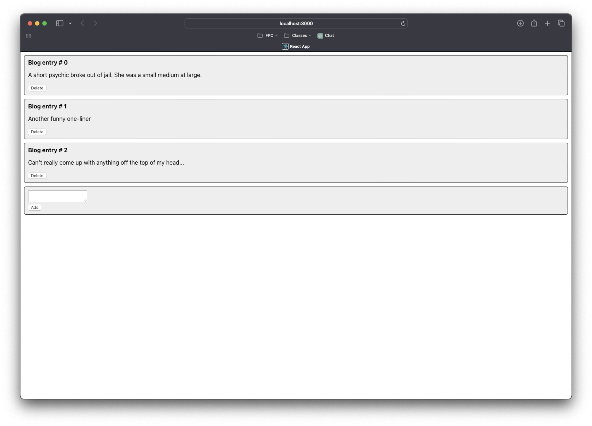
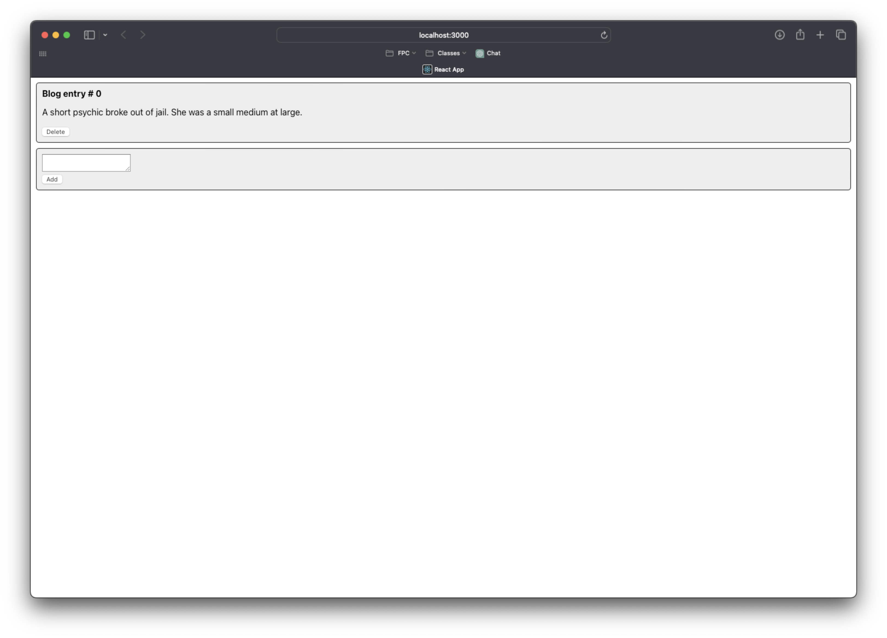
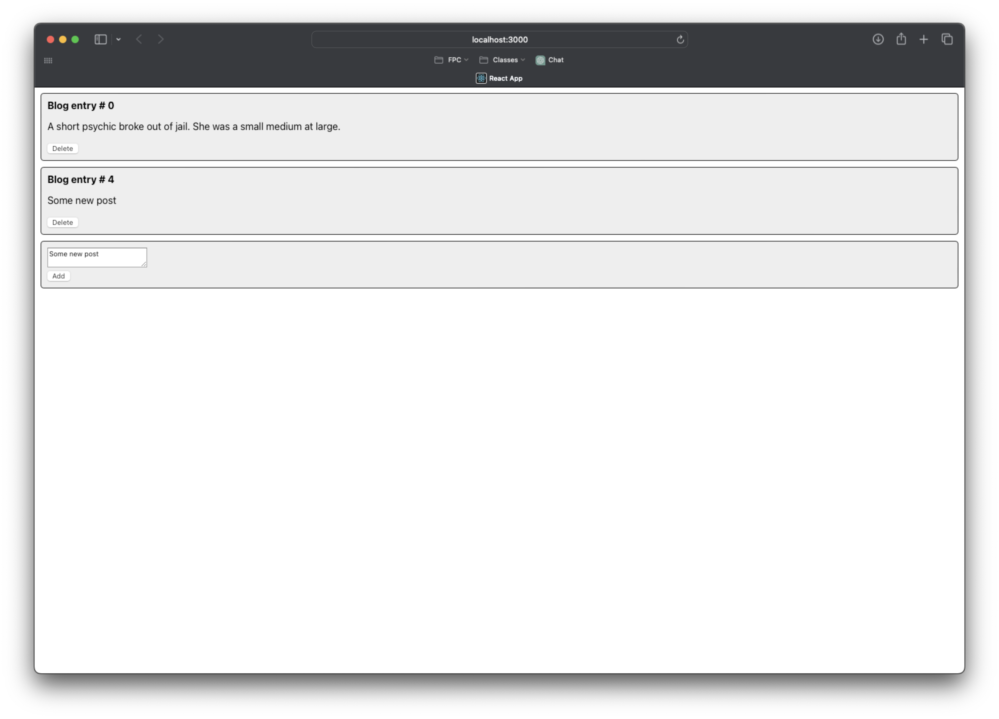
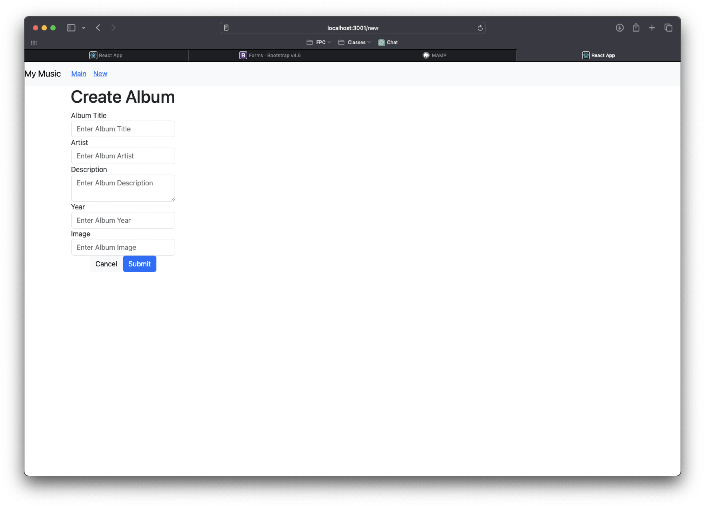
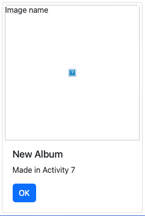
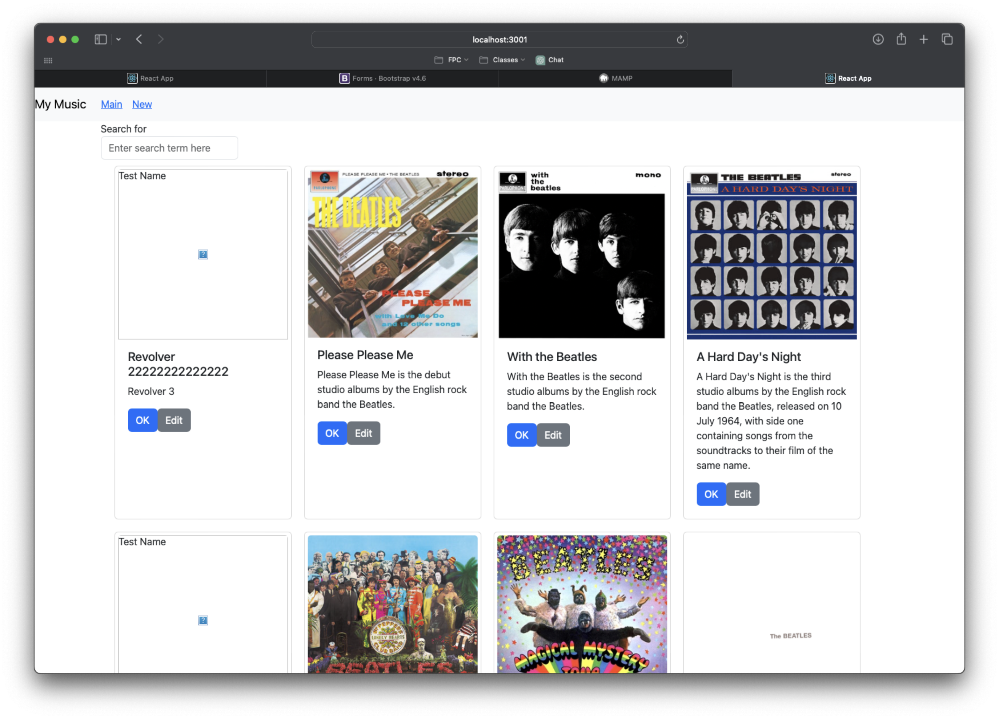
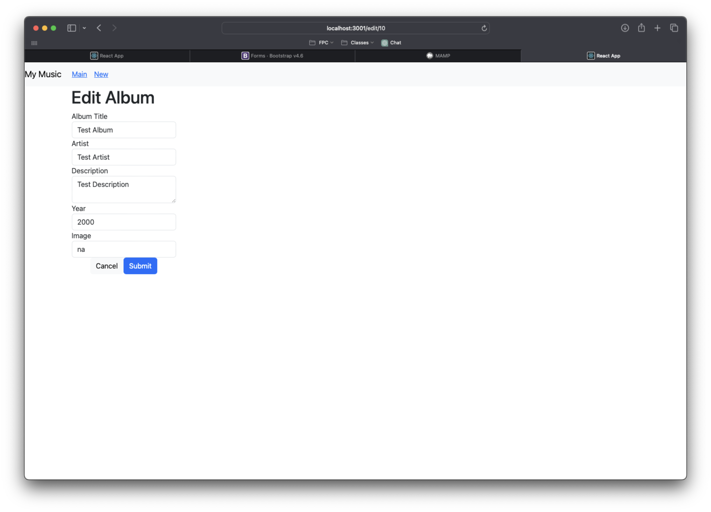

# Activity 7

<!-- 1. Cover Sheet -->
Timothy Beers \
College of Science, Engineering, & Technology, Grand Canyon University \
CST-391: JavaScript Web Application Development \
Professor Bobby Estey

## Introduction

In this Activity we will be exploring some new React APIs in a mini application, and then wrapping up our React music app. 

## Mini App #3

### Screenshots

- This screenshot shows the mini application on startup, with hardcoded posts displayed in a list.

- This screenshot shows the working functionality of the delete button on posts, with two less than we started with.

- This screenshot shows the add post form working, with a new post matching the content in the text field.

## Part 6

### Screenshots

- This screenshot shows the form added to the music app that allows new albums to be created. 

- This screenshot shows an album created from our new form.

### Summary

In this part of the activity, we added a new form to the music app. The form structure was copied from bootstrap, but converted into JSX and updated to submit the input data to our API and navigate back to the home page when a new album is successfully created.

## Part 7

### Screenshots

- This shows the new main page with edit buttons added to the album cards.

- This screenshot shows the refactored Add album component that now shows an "Edit" title with album information filled in when one is passed to the component.

### Summary

In this part of the activity, we refactored a component to be reusable in more than one spot. The Add Album component previously only supported adding new albums, but can now be passed an album to show and use the appropriate verbiage and methods for editing an album. By using the same component for these two different functionalities, we ensure that future UI updates only have to be made once to reflect on both.

## Conclusion

In this Activity, we started by creating a mini application that demonstrated multiple state updates being used between parent and child views. We then wrapped up the React music application, finishing the functionality for Adding a new album. Finally, we updated the Add Album component to support editing an album as well, allowing 3/4 of CRUD operations to be performed through the app.